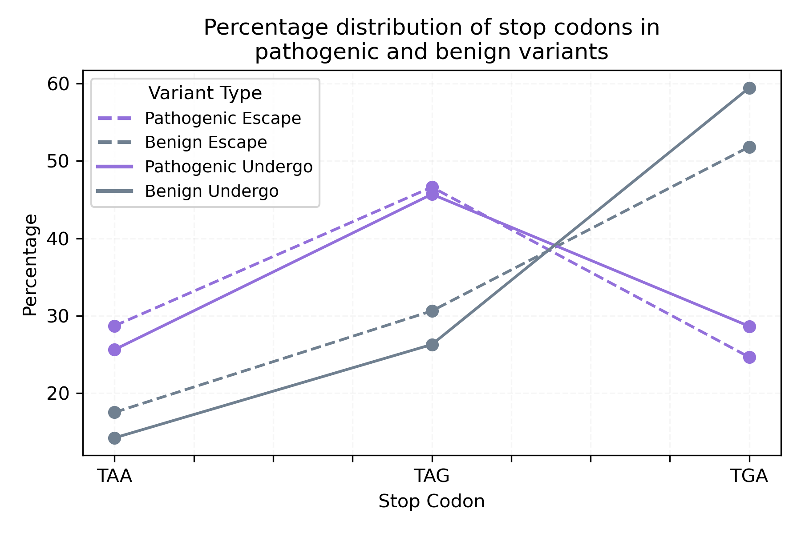
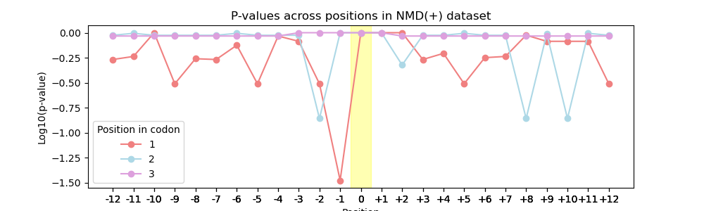
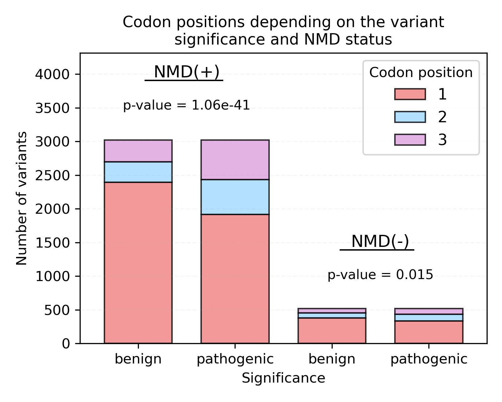
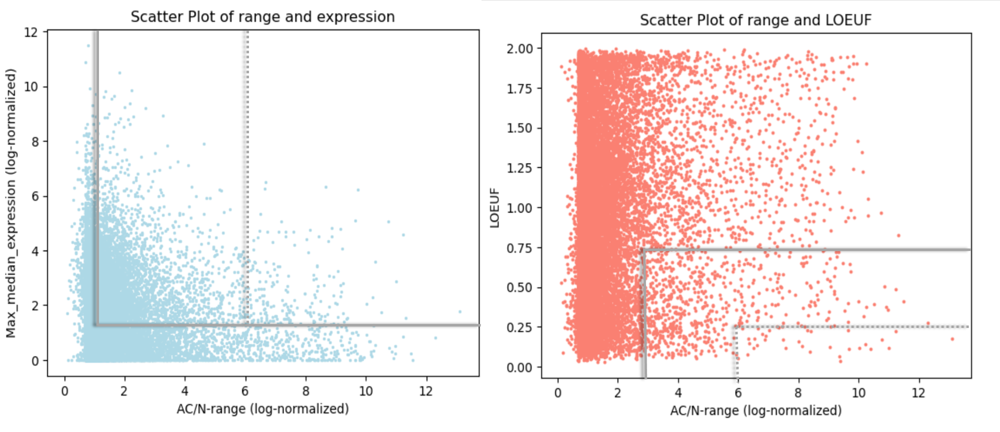
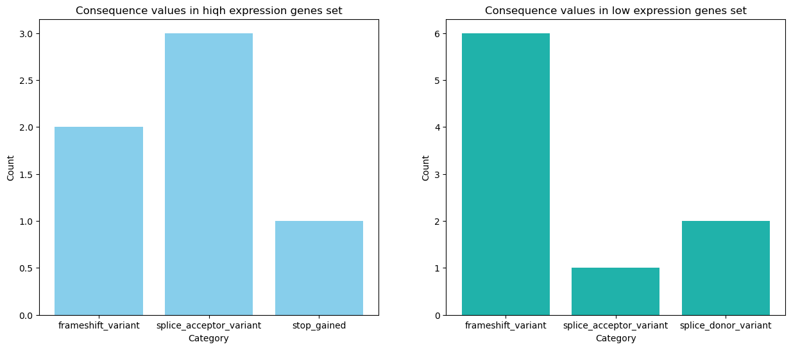

# Improving the prediction of genetic variant effect using large-scale human genome variation data  

  #### Students:
  * [Irina Grishchenko](https://github.com/grishchenkoira)   
  * [Anastasia Ivanova](https://github.com/nastasia-iv/)    
  #### Supervisor:
* Yury Barbitoff (Institute of Bioinformatics Research & Education)  

  ## Overview
Evaluation of the functional effects of genetic variants is a crucial task for the interpretation of NGS results in rare disease diagnostics. Besides, understanding of the functional consequences of genetic variants is no less important for enhancing our understanding of how and why variants may have different effects in different cases. Recently, the Genome Aggregation Database (gnomAD) released an updated version of the human genome variation dataset, now including as many as 800,000+ human exomes and genomes.  
  
The **goal** of this project is to utilize the gnomad v.4.0.0 dataset to improve the prediction of genetic variant effects and explore patterns of variation using different types of variants.  
   
To reach this goal, we work in several independent directions:  
* Analyze the relationship between variant frequency and sequence context.  
* Determine the parts of the gene sequence under increased evolutionary constraint.

  ## Materials and methods
For the analysis, [vcf-formatted tables](https://gnomad.broadinstitute.org/downloads#v4) containing exome data for autosomes were utilized.  
The work was performed on Windows 10 x64 and Ubuntu 20.04.2 LTS. The code was developed utilizing Python 3.12.2. Both parts of the analysis use different third-party packages, the required dependencies for each task are listed in the corresponding `environment.yaml` file.

  ## Results
    
### Analysis of the relationship between variant frequency and sequence context    
  
1. Among potentially pathogenic variants, the TAG codon was more common (47% and 46% for NMD(-) and NMD(+), respectively), and among potentially benign variants it was TGA (52% and 59%, respectively). As expected,  transitions were more common than transversions (p-value = 0.0002  for NMD(+), p-value = 1.98e-31  for NMD(-)).  

  

 
2.  Most of the stopgain variants occur at the 1st position in the codon for both NMD(+) and NMD(-) datasets.  
   This is expected because the second and third nucleotides of the codon, although also important, can be more flexible and can undergo mutations more often without the occurrence of a stop codon.  
  
3.  Context analysis between pathogenic and non-pathogenic variants did not show statistically significant differences, except for a possible statistical difference at -1 position for variants located in the first codon position for the NMD(+) dataset (p-value = 0.03).

  

  
4.  Analysis using chi-square showed that the relationship between the variant codon position and the variant's pathogenicity is statistically significant.  

  

  
### Transcript Conservation Assessment
1. The gnomAD database uses LOEUF as a conservativeness metric. It is based on the number of substitutions in a gene or transcript, but does not take into account the occurrence of a particular variant. In our analysis, we tried to introduce our own metric to assess transcript variability - the ratio of the total number of alleles (AC) in a transcript to the total number of variants in this transcript (N). The essence of this metric is that it takes into account not only the total number of variants found in the transcript, but also their total representation in human populations
2. Using the introduced metric, as well as expression levels and loeuf values, we set boundaries for selecting genes that deviate from typical values. As a result, we received 340 genes for further analysis.
   
3. Several gene examples have been selected  from our list using the most rigorous selection criteria. All the identified genes are pivotal regulatory protein-coding genes. Remarkably, in every instance, the transcript hosting the predominant variant was observed to be shorter than the canonical transcript. 6 cases revealed associations between the variant and the emergence of a splice site, typically positioned at the transcript's outset. Moreover, in 8 cases, the variant fell into the frameshift category and predominantly appeared at the end of the coding sequence. The distribution of variant types varied based on the genes' expression levels.
   
