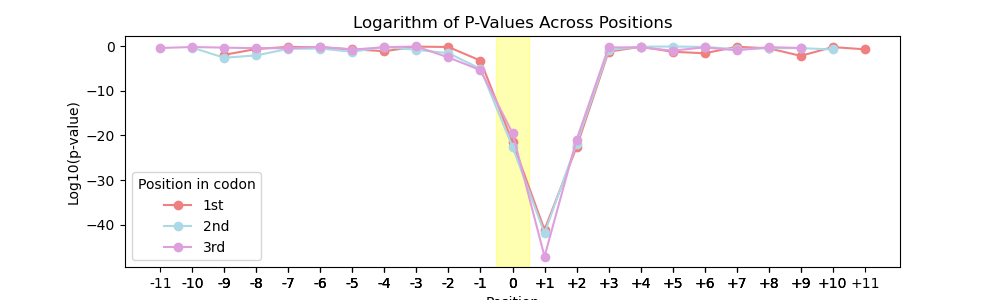

## Improving the prediction of genetic variant effect using large-scale human genome variation data  

  #### Students:
  * [Irina Grishchenko](https://github.com/grishchenkoira) (место работы?)  
  * [Anastasiia Ivanova](https://github.com/nastasia-iv/) (место работы?)  
  #### Supervisor:
* Yury Barbitoff (Institute of Bioinformatics Research & Education)  

  ### Overview
Evaluation of the functional effects of genetic variants is a crucial task for interpretation of NGS results in rare disease diagnostics. Besides, understanding of the functional consequences of genetic variants is no less important for enhancing our understanding of how and why variants may have different effects in different cases. Recently, the Genome Aggregation Database (gnomAD) released an updated version of the human genome variation dataset, now including as many as 800,000+ human exomes and genomes.  
  
The **goal** of this project is to utilize the gnomad v.4.0.0 dataset to improve the prediction of genetic variant effects and explore patterns of variation using different types of variants.  
   
To reach this goal, we work in several independent directions:  
* Analyze the effects of sequence context on variant frequencies. 
* Determine the parts of the gene sequence under increased evolutionary constraint. 

  ### Results
    
#### Analysis of the sequence context effects on variant frequencies  
  
1.  Most of the stopgain variants occur at the 1st position in the codon for both NMD(+) and NMD(-) datasets.  
   This is expected, because all three stop codons start at the same nucleotide. But the second and third nucleotides of the codon, although also important, can be more flexible and can undergo mutations more often without the occurrence of a stop codon.  
  
2.  Context analysis between pathogenic and non-pathogenic variants did not show statistically significant differences, with the exception of a possible statistical difference at -1 position for variants located in the first codon position for the NMD(+) dataset (p-value = 0.025).
  

4.  Analysis using chi-square showed that the relationship between the variant codon position and the pathogenicity of the variant is statistically significant: NMD(+) p-value = 7.3e-41; NMD(-) p-value = 0.021.
   
